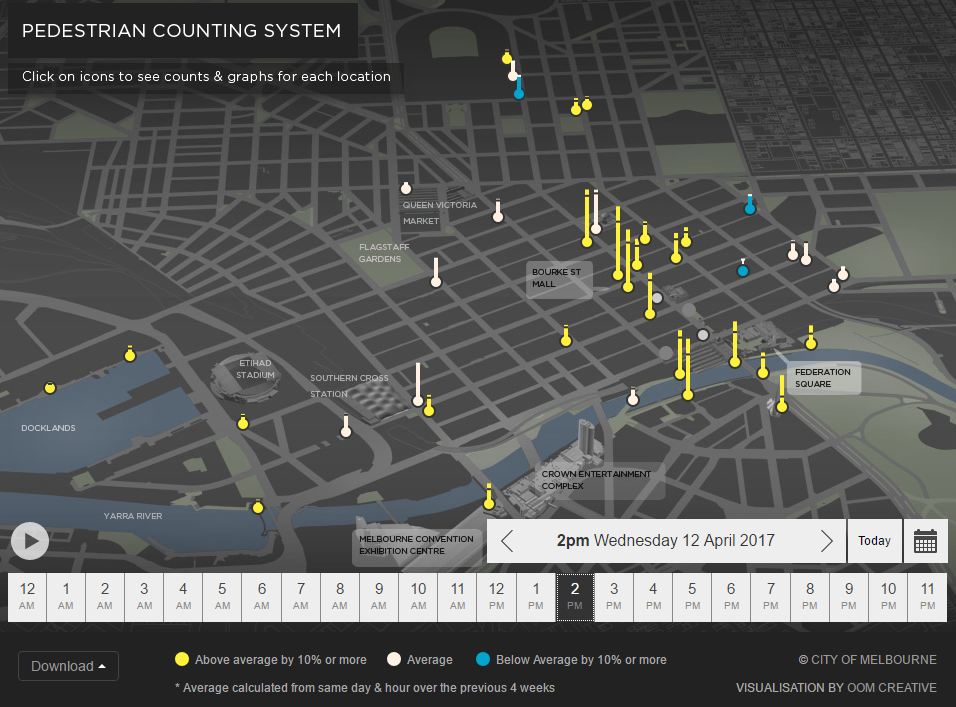
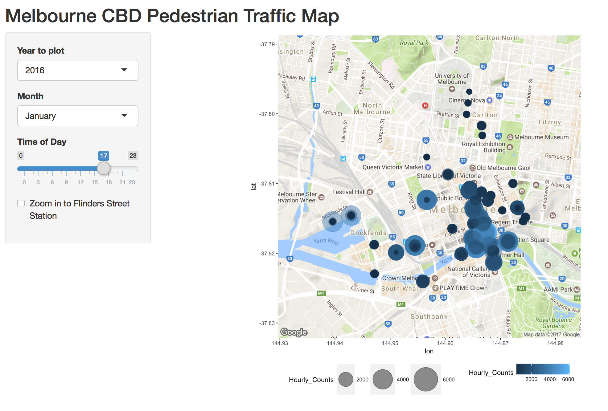

```{r setup, include=FALSE}
knitr::opts_chunk$set(echo = TRUE)
options(scipen = 100)
library(readr)
library(dplyr)
library(ggplot2)
library(ggmap)
library(knitr)

```

```{r, echo = FALSE, messages = FALSE, include=FALSE, cache=TRUE}
  ped_df <- read_csv("../data/Pedestrian_volume__updated_monthly_.csv")
      ped_df$Year <- as.factor(ped_df$Year)
      ped_df$Month <- as.factor(ped_df$Month)
      ped_df$Month <- factor(ped_df$Month, levels(ped_df$Month)[c(5,4,8,1,9,7,6,2,12,11,10,3)])
      ped_df$Time <- as.factor(ped_df$Time)
      ped_df$Timeplot <- as.integer(ped_df$Time)
      ped_df$MTime <- as.integer(ped_df$Time) + ((as.integer(ped_df$Mdate)-1) * 24)
      ped_df$Day <- as.factor(ped_df$Day)
      ped_df$Day <- factor(ped_df$Day, levels(ped_df$Day)[c(2,6,7,5,1,3,4)])
      
  ped_loc <- read_csv("../data/Pedestrian_sensor_locations.csv")
  
  melb <- get_map(location=c(mean(range(ped_loc$Longitude)),
                               mean(range(ped_loc$Latitude))),
                                zoom=14)
```

## Topic
The City of Melbourne provides an open data platform to access council datasets, with the intention "to increase transparency, improve public services and support new economic and social initiatives"[^1]. This paper will focus primarily on the pedestrian data collected from pedestrian sensors placed throughout Melbourne's CBD. In particular, we want to be able to model the pedestrian traffic at different locations in the CBD, and forecast the traffic. In addition, we aim to have an interactive, dynamic data visualisation of the model to help us to understand how Melbourne operates. 

## Background  

#### The Data: City of Melbourne Pedestrian Data  

The dataset being investigated can be obtained from the official City of Melbourne's open data[^2]. The pedestrian data is in the form of hourly pedestrian counts for `r nrow(ped_loc)` sensor locations. In total, there is `r nrow(ped_df)` observations in the dataset. It is available in `.csv` format, allowing for easy data import into R.  

[^1]: from _'About Melbourne Data'_ page at https://data.melbourne.vic.gov.au/about

[^2]: the specific pedestrian data is available at   https://data.melbourne.vic.gov.au/Transport-Movement/Pedestrian-volume-updated-monthly-/b2ak-trbp


```{r, echo = F, fig.align= "center", fig.width=3.5, fig.height=3.5, cache=TRUE}
ggmap(melb) + geom_point(aes(x = Longitude, y = Latitude), data = ped_loc, colour = "red", alpha = 0.7) +
              labs(title = "Melbourne Pedestrian Sensor Locations") +
              xlab(NULL) + ylab(NULL) +
              theme(plot.title = element_text(hjust = 0.5), plot.caption = element_text(hjust = 0.5),
                    axis.text.x = element_blank(), axis.text.y = element_blank(),
                    axis.ticks = element_blank())
```
\begin{center}
\textbf{Figure 1}:  Locations of all pedestrian sensors around Melbourne's CBD as at April 2017 - Plotted using `ggmap`, the red points map the locations of the sensors. The majority of the pedestrian sensors are placed in the eastern side of the CBD, particularly along Swanston St
\end{center}  

These sensors are placed above flowing traffic either under an awning or on a street pole, recording movements from multiple directions. The pedestrian counting system was introduced by the council with the objectives to help inform decisions about urban planning and management, identify opportunities to improve city walkability and transport, to measure the impact of events and specific marketing campaings, as well as to monitor retail activity and aiding the business community with marketing and resource management.  

Each observation in the data contains three main variables: the specific hour (date and time of day), location (sensor ID) and the pedestrian count for the hour. Other variables were also included such as the month, date, hour of the day, etc.. to help with the analysis. These variables do not being in any additional information however.  

```{r, message= FALSE, warning= FALSE, fig.height=4, fig.width=6, echo = FALSE, fig.align= "center", cache=TRUE}
  ggplot(ped_df[ped_df$Sensor_ID == "3", ]) + 
    geom_smooth(aes(x = Timeplot, y = Hourly_Counts, colour = Month), se = F) + 
    xlab("Time of the Day") + ylab("Pedestrian Count") + 
    ggtitle(ped_loc$`Sensor Description`[ped_loc$`Sensor ID` == "3"]) +
    facet_wrap(~ Day) + theme(plot.title = element_text(hjust = 0.5), legend.position = "none") +
    scale_x_continuous(limits = c(0,24))
```
  
\begin{center}
\textbf{Figure 2}: Smoothed pedestrian counts for Melbourne Central by day of the week and month of the year
\end{center}  

We are faced with two large limitations due to the nature of the collection of the data. Firstly, pedestrian counts are aggregated hourly. This does not allow for highly accurate modelling. Secondly, we note that there is a lack of sensors, and hence pedestrian data, for the area between Spencer Street and Elizabeth Street. The majority of the sensors have been installed by the City of Melbourne along Swanston Street. The consequence of this is the potential to make misleading conclusions regarding the pedestrian activity in that area. Plotting pedestrian traffic of the entire CBD may give the inaccurate perception of very low/no pedestrian activity.  
It is hoped that pedestrian data based on WiFi points around the CBD, which has greater spatial coverage and a higher degree of resolution (counts aggregated every 15 minutes), will be available. The analysis based on the sensor data should remain valid for the WiFi data.  


#### Current Pedestrian Data Visualisation  

The City of Melbourne currently has an online visualisation tool which is publicly accessible at [City of Melbourne Pedestrian Counting System](http://www.pedestrian.melbourne.vic.gov.au) (`http://www.pedestrian.melbourne.vic.gov.au`). This visualisation features an interactive map of Melbourne's CBD with markers indicating the the location and the pedestrian activity at the location for a given time and date.  

```{r, out.width= '70%', echo = FALSE, fig.align= "center"}

```

\begin{center}
\textbf{Figure 3}: Pedestrian Counting System Visualisation from www.pedestrian.melbourne.vic.gov.au - The UI allows the user to choose specific dates and hours of the day to visualise on a 3D perspective map. The visualisation can also animate pedestrian activity, allowing for changes over time to be easily seen.

\end{center}  
  
  
Pedestrian activity is represented by two aesthetic features - size and colour. The markers, in the shape of thermometers, change in height based on the absolute pedestrian count, with a colour scale from blue to white to yellow, analogous to temperature, to map the relative diference in activity. The colour changes when the hourly counts deviate by more than 10% from the average count over the previous four weeks for the same day of the week and time of the day.  In addition to these aesthetics, the plot itself is both interactive and animated.  

The main advantage of an animated/dynamic plot is that the changes over time can be visualised effectively for multiple sensor locations. This is particularly useful in reducing change blindness[^3] in the peception of the data visualisation, as it is easier for people viewing the plot to see relative changes from one hour to the next at a certain location. However, a particular aspect which needs to be improved on is the ability to visualise the pedestrian activity levels around the whole city at once. The UI (user interface) allows some interaction by the end user. It allows the user to change the date visualisation, and either view pedestrian traffic of a particular hour of the day, or to run an animation of the whole day's pedestrian traffic. Clicking on a sensor location brings up a line graph plotting hourly counts for the day.  

Another interactive visualisation featured on the Open Data Platform ( _Figure 4_ )also presents pedestrian counts as average daily volume on a map of Melbourne's CBD. Daily counts are mapped to a size aesthetic. However, this visualisation is very limited. While it useful to see the overall average activity at a sensor location relative to other locations in the CBD, it fails to present key characteristics of the time series (discussed later). It also lacks basic features such as a legend for what colour represents.

```{r, out.width= '60%', echo = FALSE, fig.align= "center"}
include_graphics("../img/ped_vis_melb_2.PNG")
```

\begin{center}
\textbf{Figure 4}: An interactive data visualisation map created using Tableau by Boreak Silk. Average daily volumes are mapped to size, and colours map a positive or negative change in the average for the period compared to a specified reference period. Note the lack of a legend to help users understand how to interpret different aesthetic mapping of the visualisation.
\end{center}
_Source:https://public.tableau.com/profile/boreak.silk#!/vizhome/PedestrianactivityinMelbourne/Dailyvolumesandcomparison _

[^3]: change blindness is the inability to notice a change in visual stimulus introduced

#### Modelling a time series with multiple seasonal patterns    
  
The pedestrian data is presented as a time series. However, we face a major obstacle with pedestrian data: multiple seasonal patterns. Looking at the data on a month to month basis at a single sensor location, we have two main cycles: a daily sub-cycle within a weekly cycle.
```{r, message= FALSE, warning= FALSE, fig.height=2, echo = FALSE, fig.align= "center"}
bsplot <- ped_df %>% filter(Year == "2016", Month == "June", Mdate < 25, Sensor_ID == "13")
ggplot(bsplot) + geom_line(aes(x = MTime, y = Hourly_Counts)) +
      xlab("Hour of the Month") + ylab("Hourly Counts") + theme_light()
```
\begin{center}
\textbf{Figure 5}:  Sample of hourly counts of pedestrians at Flagstaff Station (June 2016). Two repeating cycles can be seen, with a public holiday on 13 July showing atypical pedestrian counts for a weekday (Monday).
\end{center}  
From _Figure 5_, we can observe multiple characteristics of the time series. Firstly, we see the weekly cycle, where weekdays (Monday to Friday) have lots of activity and weekends (Saturday and Sunday) are relatively quiet. This would be highly suggestive that Flagstaff Station is primarily used by city office workers. Another phenomenon we observe is the effect of a public holiday. Looking near the middle of the month (Monday, 13 June 2016), we have the Queen's Birthday public holiday. We must also note that, prior to the start of 2016, Flagstaff Station was not operating on weekends, nor public holidays.
```{r, message= FALSE, warning= FALSE, fig.height=3, echo = FALSE, fig.align= "center"}
ggplot(filter(ped_df, Sensor_ID == "13")) + geom_path(aes(x = as.integer(Time), y = Hourly_Counts, colour = Day), alpha = 0.2) +
      xlab("Hour of the Day") + ylab("Hourly Counts") + theme_light()

```
\begin{center}
 \textbf{Figure 6}:  Hourly counts at Flagstaff Station, with colour mapped to day of the week - There are two distinctly different daily patterns. The typical weekday traffic pattern has two peaks at 9am and 5pm, while it remains relatively quiet over the weekend as seen by the flatter lines. Also note that the second peak is lower than the first peak on average.
\end{center}  

In _Figure 6_, we see that, within the weekly cycle, each day has a daily sub-cycle. We can see the patterns we observe on a weekly cycle here when we seperately estimate by the day of the week. What we can see more clearly is also the difference in the pattern of pedestrian activity for each hour of the day, where there are two main peaks per weekday. This is consistent with the peak travel times for people commuting to and from work.  

The consequence of having multiple seasonalities in the time series is that typical time series do not deal with multiple seasonalities well. 

#### R and Shiny Apps  

R is an open source programming language used for statistical computing. Shiny, made by RStudio, is a web application framework for R. It allows us to easily develop interactive web applications which interface with R in the background.  Combining these with open source packages in R, such as `ggplot2` or `plotly`, we can develop dynamic, interactive visualisations for data.  

In particular, the objective of this project is to have the modelled pedestrian data presented as an interactive web app using Shiny. A key part which makes the visualisations interactive is the ability to have user inputs. This may be in the form of selecting a time period for the data, or changing how a certain plot is generated (size, colour, etc..). A feature which we can implement is an interactive forecast, allowing the user to change some of the input variables in the predicitive model.

## Methodology  

### Data Cleaning
  
  The first step in performing the analysis is to clean the data. In particular, we need to impute the missing values at certain sensor locations. This is cause by two primary reasons: 1) new sensors being installed over time, and 2) sensors not operational for periods of time. A possible model which has been proposed is a GLM (generalized linear model) to estimate a Poisson regression: 
  
\begin{align*}
\text{HourlyCounts} & \sim\text{Year}\times\text{HDay}\times\text{Time}+\text{Month}\\
\Rightarrow\qquad \log{\lambda_{i}} & =\beta_{0}+\beta_{1}\text{Year}\times\text{HDay}\times\text{Time}+\beta_{2}\text{Month}\\
\text{HourlyCounts}_{i} & =\text{Poisson}\left(\lambda_{i}\right)
\end{align*} 
  
This estimation is computed for each sensor individually, as each location will have unique characteristics. This model assumes that the hourly pedestrian counts for a given location is dependent on the time of day, `Time`, where the `Year` and day of the week has as interaction effect. `Month` has an additive effect in this model, rather than an interactive effect. This would imply that the month of the year does not affect the pattern of activity for a given day of the week and time of day.  

In equation \ref{poisson_model}, the variable `HDay` refers to a factor variable with 8 factor levels: the 7 days of the week and a factor for a public holiday. This is generated such that, if the day is a public holiday, then `HDay = "Holiday"`, regardless of the day of the week. Otherwise, `HDay` is the same as the factor for the day of the week.  
Alternatively, it would be possible to allow for the effect of a public holiday by including a separate dummy variable. However, the likelihood of overfitting is greater, as we have a lack of public holidays as it is, let alone the lack of holidays falling on each day of the week. Similarly, the inclusion of the `Year` variable may introduce similar problems, especially at newer sensor locations with a lack of historical data.  

The purpose of this estimation is purely for the imputation of missing values, so prediction within this period is the highest priority at this point. While it would be desirable, this model is not intended to forecast future values. Evaluating the model's goodness of fit, we perform cross validation. Splitting the data randomly 60/40 into a training set (data for model estimation) and a test set (data set to test the goodness of fit), we can get a quick evaluation of the model's performance. Where total number of observations is $T$, we split the data into $N \approx 0.6 \times T$ and $M \approx 0.4 \times T$ so that $T=N+M$. Then, we have:
$$\text{MSE}_\text{Tr} = \frac{1}{M} \sum_{j=1}^{M} (\hat{y_t}-y_t)^2$$
LOOCV (leave one out cross validation) is not computationally feasible due to the large number of observations.
  
Another decision which needs to be made is the starting date to model from. With multiple sensors being installed years later after the initial 28 sensors were installed and capturing data, we do not have a complete set of observations over the total observation period at each sensor location. Consequently, we will only use data from 2014 onwards, as this appears to be the most complete and comprehensive time period where the obeservations provide useful information.

### Data Modelling

After the imputation of the missing values, we want to model the data (under the assumption that it is now complete for a given time period). In particular, we want to see if we can model pedestrian activity with weather data from the Bureau of Meteorology. The motivation for this is the availability of weather forecasts. Without looking at the data, we would expect that the effects of weather to have a greater effect on weekends and public holidays than on weekdays. The intuition behind this hypothesis is that activity in the CBD during weekends and public holidays is generally for leisure, whereas weekday activity is primarily for business and commercial activities.  

Weather may also have a casual effect by month of the year, due to seasonal weather. This could help explain differences in activity levels in summer compared to in winter in certain locations. This effect may also only have an effect in outdoor locations, and not on indoor locations. For example, Melbourne Central, a retail shopping area, is affected by `Month`, but most likely not weather. From _Figure 2_, we see that the average peak actvity on Fridays and Saturdays in January is significantly lower than other months of the year, while weather conditions are similar to December and February. This is most likely to be explained by typical seasonal consumer behaviour: peak consumer spending occurs in December due to Christmas gift shopping and Boxing Day sales. As a result, guilt ridden consumers tend to wind back retail spending during January. It can also be explained by people going on vacations out into regional/rural areas.  

The use of weather data to improve forecasting performance would be ideal, due to the availability of weather forecasts compared to many other forms of data. Machine learning techniques will also be explored. In particular, clustering of sensor locations may be useful in identifying patterns at certain types of location, such as tourist attractions and shopping districts.  Different models for different types of locations may be used, and clustering may give insights as to which type of model to use. For example, the major city loop train stations, Flinders St, Southern Cross and Melbourne Central may have similar patterns. Then, we would expect to be able to use the same parameterisation of the model to estimate. After a model has been established, we need to evaluate the performance of the model. For this, we have decided to minimise the RMSFE (root mean square forecast error). Assuming that we estimate the model with $T$ observations, and we have $k$ points to forecast (so we need to have $T+k$ observations available), then our RMSFE is:
$$ \text{RMSFE} = \sqrt{\frac{\sum_{t=T+1}^{T+k}(\hat{y_t} - y_t)^2}{k}}$$


### Data Visualisation  

Once a model for forecasting the data has been established, visual methods for illustrating the model need to be developed.

Improving on the currently available visualisations, the aesthetics of the visualisation will be designed with human perception theory taken into consideration. Preattentive processing theory will be considered to ensure certain elements of the visualisation allow for quick, preattentive identification of busy and quiet areas. Change blindness theory should also be reviewed in order to avoid misperception of relative changes in pedestrian activity.  

To plot values on a map of the CBD, the R package `ggmap` is being used currently. The plots are created using the package `ggplot2`, which has the capability to generate many different types of plots. Choosing an appropriate combinations of plots will be important here to present the model accurately.

### Shiny App Development  

To implement the visual methods, an interactive web application to present the model will be developed.  

For testing the proof of concept, a simple web application for viewing average hourly counts for a given month (for a given year) on a map was developed. A key aspect which we want to implement is the ability for the end user to forecast pedestrian activity in the future.
```{r, fig.align = 'center', echo = FALSE, out.width = "66%"}

```

Methods for making the app run efficiently need to be investigated, as each plot needs to be rendered after any changes to the input values in the UI (eg. changing time of day requires the plot to be rendered again). This is highly inefficient and not feasible for use on a public website. This problem will be exacerbated when a predictive model is added, as the model will need to predict values before the plots are rendered.

Decisions regarding the design of the user interface also need to be made, specifically with the inputs which will be made available to users.

## Limitations  

#### Data  
The pedestrian sensor dataset is very limited in its spatial coverage. There is a possibility of data collected from WiFi devices being made available, which would increase both the spatial coverage and the resolution (counts aggregated every 15 minutes instead of hourly).

#### Model  
The model itself is currently limited to being treating the data as static panel data. A major reason for this is the nature of the data, where the patterns from year to year do not change.  

#### Visualisation  
Ideally, having a dynamic spatial model would allow us to visualise the pedestrian activity in areas not covered by the currently installed sensors. However, due to time constraints, the visualisation will most likely be based on a model of predictions of pedestrian counts at each sensor location. Improvements to the quality of the map can be made with utilisation of the R package `leaflet`. Other packages being explored for visualisations also include `plotly`.

## Research Plan
The plan to approach this research project is as follows:

- Imputation that incorporates time and space
- Creating a predicitive model for each sensor
- Investiagtion of visual methods for space-time counts
- Development of a Shiny app: interface design, computation and data backend
- Generation of a dynamic spatial model (if time permits)

## Acknowledgements 

I would like to thank my supervisor, Dianne Cook, for her help and support throughout this project. I would also like to thank Earo Wang for coming along to our meetings to help out, in particular for her code for imputing missing values.

This proposal is written in R Markdown (`.Rmd`) using RStudio and the code used to produce the results outputted are embedded in this document. The packages used for this proposal are: `readr, dplyr, ggplot2, ggmap, knitr`, while packages `lubridate, shiny` are also being used for the project iteself. 

## References  
  1. City of Melbourne, _'About Melbourne Data'_, https://data.melbourne.vic.gov.au/about,  
   $\quad$ _accessed 18 April 2017_  
   
  2. City of Melbourne, _'Pedestrian Counting System'_,  
   $\quad$ http://www.pedestrian.melbourne.vic.gov.au/pdf/CityofMelbournePedestrianCountingSystem.pdf  
  4 May 2015, _accessed 18 April 2017_  
  
  
  3. Gould, Phillip G., Koehler, Anne B., Ord, J Keith., Snyder, Ralph D., Hyndman, Rob J.,  
   $\quad$ Vahid-Araghi, Farshid, (2008) _'Forecasting Time Series with Multiple Seasonal Patterns'_, European Journal of Operational Research 191(1), 207–220  
   
  4. Healey, Christopher G., (2012) _'Attention and Visual Memory in Visualization and Computer Graphics'_, IEEE Transactions on Visualization and Computer Graphics,  
  https://www.csc2.ncsu.edu/faculty/healey/download/tvcg.12a.pdf

  5. Wickham, Hadley, Francois, Romain,  _'dplyr'_ , http://dplyr.tidyverse.org

  6. Wickham, Hadley, Chang, Winston,  _'ggplot2'_ , http://ggplot2.tidyverse.org
  
  7. Wickham, Hadley, Kahle, David J., _'ggmap'_ , https://github.com/dkahle/ggmap
  
  8. Wickham, Hadley, Hester, Jim, Francois, Romain, _'readr'_ , http://readr.tidyverse.org
  
  9. Xie, Yihui, _'knitr'_ , https://yihui.name/knitr/

  
  
\newpage
  
# Appendix

### Plots of time series at each sensor location over entire time span from 2009:  

```{r, echo = FALSE}
ped_plot <- aggregate(x = ped_df$Hourly_Counts, by = list("Sensor_ID" = ped_df$Sensor_ID, "Year" = ped_df$Year, "Month" = ped_df$Month), FUN = sum)

ped_plot$counts <- ped_plot$x


ped_plot$Time <- parse_date(paste(ped_plot$MDate, ped_plot$Month, ped_plot$Year, sep = "-"), format = "%D-%B-%Y")

ped_plot$ID <- as.integer(ped_plot$Sensor_ID)

ggplot(filter(ped_plot, ID < 10)) + geom_line(aes(x = Time, y = counts)) + facet_wrap(~ Sensor_ID)

ggplot(filter(ped_plot, ID > 10, ID < 20)) + geom_line(aes(x = Time, y = counts)) + facet_wrap(~ Sensor_ID)

ggplot(filter(ped_plot, ID > 20, ID < 30)) + geom_line(aes(x = Time, y = counts)) + facet_wrap(~ Sensor_ID)

ggplot(filter(ped_plot, ID > 30, ID < 40)) + geom_line(aes(x = Time, y = counts)) + facet_wrap(~ Sensor_ID)

ggplot(filter(ped_plot, ID > 40)) + geom_line(aes(x = Time, y = counts)) + facet_wrap(~ Sensor_ID)

```
Looking at the plots of the monthly aggregates, we can inspect the data quickly for obvious outliers. After detrending the time series for both the deterministic trends (non-zero mean) and stochastic trends (weekly and daily cycles), we expect to have a stationary series. Anything outside these "expected" trends from the cycles could indicate an unobserved variable (such as weather) having a casual effect on the pedestrian count. Large "dips" in the series, or odd values over a long time span may be indicative of missing values which need to be imputed.

Note that the Sensor ID #41 is missing from the data for unknown reasons. 

  
